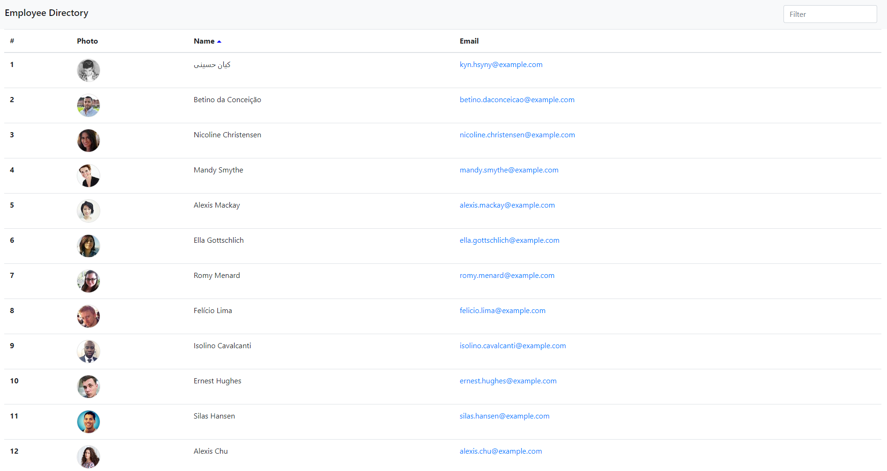

# employee-directory

 

## Description

React employee directory. View an entore employee directory at once so that you have quick access to non-sensitive employee information and the ability to filter employees by name. Go to the [live site](https://breyera.github.io/employee-directory/) or follow the steps to see how to use.

## How To

- Go to [live site](https://breyera.github.io/employee-directory/)
- Enter the name of employee or scroll to find employee

### Important Links

- [Live site](https://breyera.github.io/employee-directory/)

### Images

### License

MIT License
